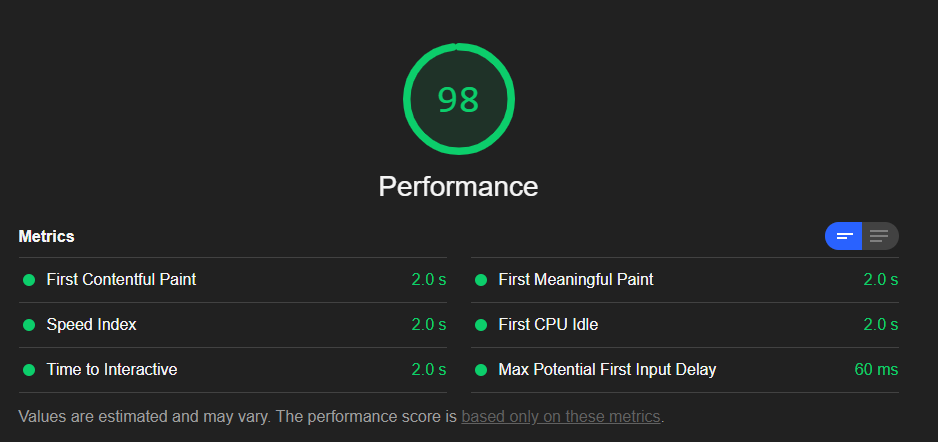

# Minimal Angular v8 Application with Server Side Rendering

## What The App Does

A sample Angular application with a lazy loaded module that contains a single component. The job of the component is to show a random one or two digit number every 3 seconds.

## Why The App Exists

This app is to represent a sample application that has lazy loading implemented as well as server side rendering(SSR). It can be used as an example of a hello-world like application that has lazy loading and SSR enabled. Moreover, it can be used to measure a hello-world like Angular application's performance with tools such as lighthouse. A lighthouse report of this app can be found [here](github/).

The above image is a lighthouse performance report of the application where environment had the following properties - cleared storage, mobile device, simulated slow 4G with 4x CPU slowdown.

## How To Build The App

+ Open cmd or terminal
+ `cd` to the project root directory
+ Run the following command: `npm install`
+ Run the following command: `npm run build:ssr && npm run serve:ssr`

The above commands install the necessary packages to run the application. After the steps are done, the app should be served on a node server in port 4000 unless a different port is specified. A thing to be noted in case there is any serve related issue, Angular v8 does not support node.js versions earlier than 10.9. So, install a version later than that to host the app in node's development server.

## How to Enable gzip Compression

gzip compression enables node.js server to return response to requests compressed. This can help determine the app's payload behavior on a production environment, as almost all production web servers have gzip or some other compression (brotli) enabled. So, in order to enable gzip compression, edit server.ts file. Uncomment line 23 and line 45-62 in server.ts file.

## How to Host on IIS

Hosting in IIS or any other dedicated web server can help understand the application's performance further due to the difference of performance among development server and production servers. IIS is used here just as an example.

In order to host the app on IIS, follow the below steps -

+ Download iisnode from [here](https://github.com/azure/iisnode/wiki/iisnode-releases), choose the version compatible with your OS and IIS
+ Install iisnode
+ Open applicationHost.config of IIS
+ Find this line: `<section name="handlers" overrideModeDefault="Deny" />` under system.webServer sectionGroup
+ Update the line: `<section name="handlers" overrideModeDefault="Allow" />`
+ Open IIS manager
+ Right-click on Sites
+ Click on Add Website
+ Give a name in "Site Name" input field
+ Add path in "Physical Path" field pointing to the app's dist folder
+ Assign a port number in "Port" field, preferably anything other than the default `80`
+ Click OK

Now the app should be visible in localhost on the specified port. In case IIS responses are not gzip compressed anymore, it is probably because dynamic compression is disabled in IIS. Learn how to enable dynamic compression on IIS from [here](https://docs.microsoft.com/en-us/iis/configuration/system.webserver/httpcompression/#windows-8-or-windows-81).
